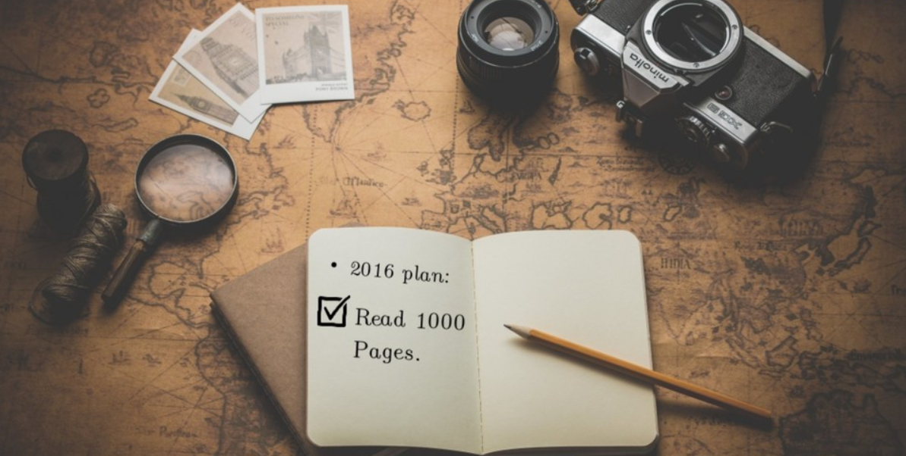
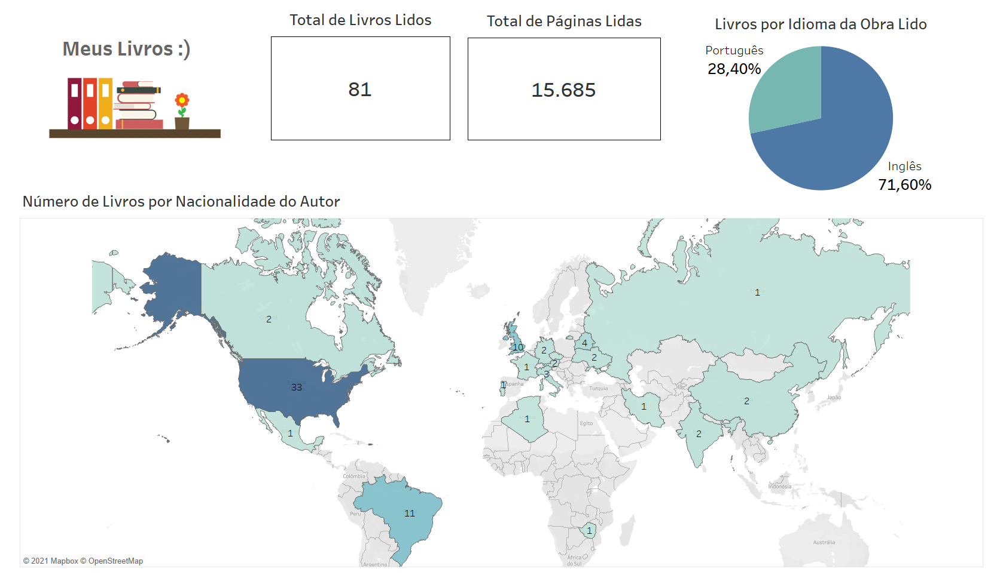
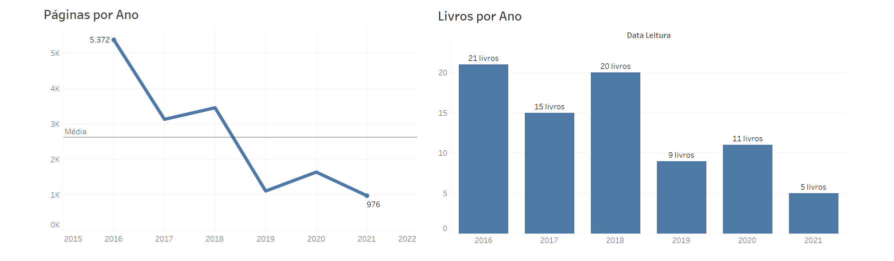
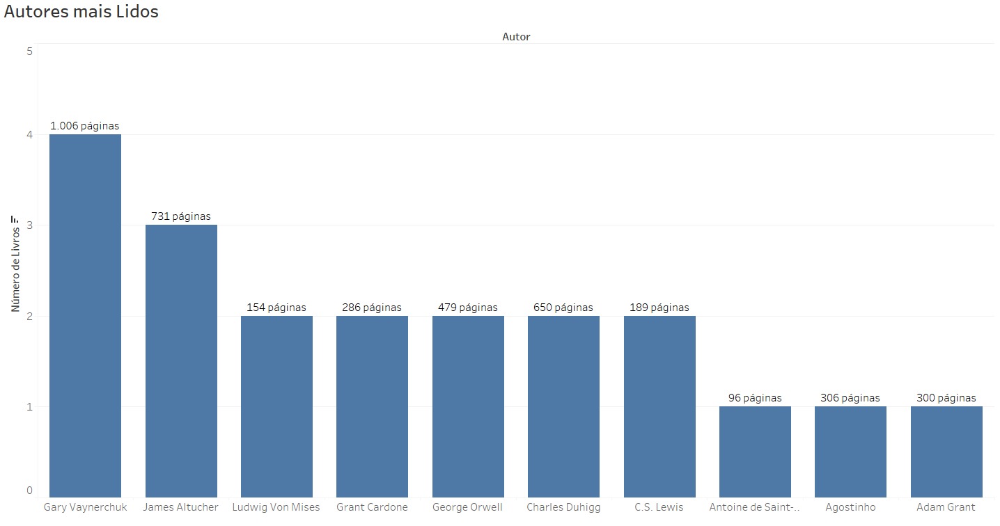
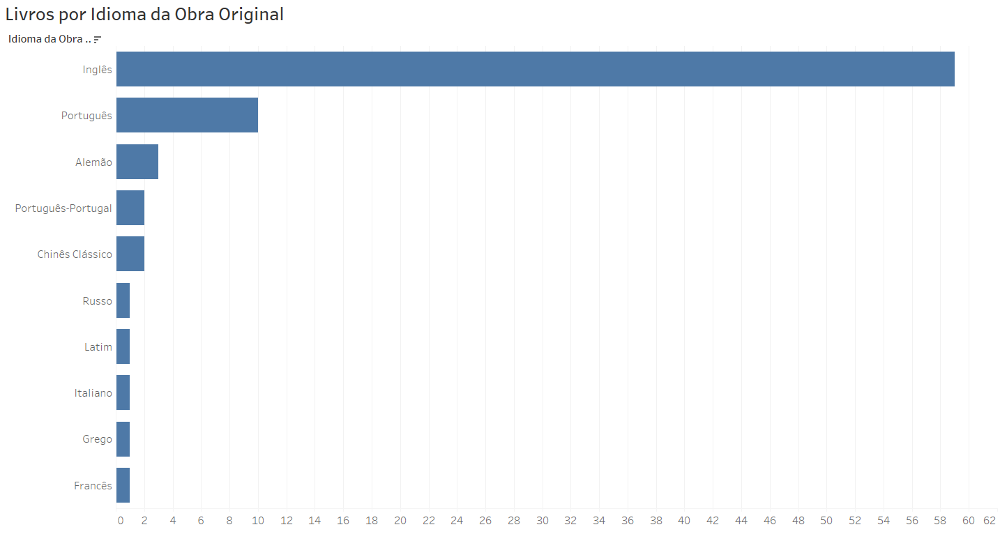
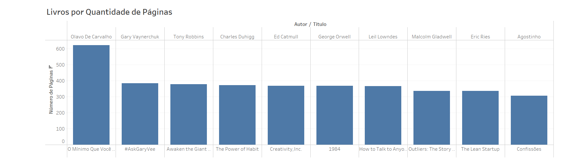

<h1 align="center">My Books 📚</h1> 

> Exploratory analysis of my Dataset 'All_the_Books_I_read' which contains all the books I've read.

---
## **Tableau Public**
* [Dashboard Meus Livros](https://public.tableau.com/app/profile/thiago.silva.farias/viz/MeusLivros/DashboardMyBooks)

---
## **Article: "1000 Pages" (2016)**

Since I was born, I think I’ve said this phrase a thousand times over and over again: “I hate reading. I don’t learn anything by reading; I’m more of a listening kind of a learner”. My parents always loved reading. In fact, they always tried to make me like reading, but as I already said, I repeated the same phrase you just read above. But in December 2015, I told myself: “dude, at least try reading a small book. Everybody likes it. Read anything. Make up a goal and go for it”. Then, I decided to set a goal for 2016. But I’m the kind of guy that usually don’t think small, ‘cause I like being intimated by these unrealistic ideas, I think. So, I set a goal to read a thousand pages in English through the year(as you deduced by the title). I thought doing it, I could do two things at once; see if what I was telling myself was true and practicing my English(I’m from Brazil, by the way) through reading.

So my first step was: I bought a tablet(the cheaper one), and then I googled “must reading books”. I found some really interesting books. So I got the books(downloaded) and I started to read. At first, I started reading “The little prince”(I know you’re laughing. Stop it! I never read it, so I should start somewhere right?). It has a really deep message on those pages. Pretty good book, and I can’t believe this is a book for kids. When I started reading it, it was like going to the gym for the first time, you know; painful and intimidated for the kind of vocabulary. My reading habit started really slowly I must say. I finished the book in 2 months. And as the gym, with consistency, you eventually get the hang of it.

 

When you start to read, effortlessly the brain absorbs and piles up all the ideas from the book. It shocked me at the time—how much I could remember things that I read. So, I kept reading, reading, and reading. I even read when I was waiting for my bus at 1:00 AM. I read from nonfiction, self-help to business books. I must say; it changed something in my brain. I’m used to learning languages with my ears, listening hours of podcasts per week; what I’m experiencing now, it’s exactly(and beyond, ‘cause I don’t know how to explain. I think nobody knows how to explain it per se) all those clichés you always hear about.

In a nutshell, I’m experiencing <b>Stress Reduction and Tranquility, Vocabulary Expansion, Memory Improvement, Stronger Analytical Thinking Skills, Focus, and Concentration Improvement, etc</b>. As far as I can tell, this is a hell of an improvement. So, when I look back now to this year, I felt kinda obligated to share my thoughts on this manner, and(of course) recommend that you try to read more books. I’ll try to be less cliché about this ok. So, if you hate reading books(or anything related to it), or just struggling to make it a habit, keep reading this article(kinda weird right? You hate reading but you’re reading this haha yeah, never mind...). So, here we go.

My advice for you is, don’t stop trying(first cliché right here, sorry about that). At first, reading is really hard, slow, and sometimes can give you headaches(I’m not lying haha). But just like any other muscle in your body, the brain requires exercise to keep it strong and healthy; so that’s when the phrase “use it or lose it” makes sense to me, and probably will to you too. At first, pick up a book that is easy, funny, and enlightening even; read it daily(consistency is important, remember it)and try not to read the whole book at once(like I did, not my best idea, I know). Make up a goal like “I’ll read this paragraph, and if I make it, and if I feel good, I’ll try to read the next one”. The thing I’m trying to say is, that’s okay to be slow(no shame on that)...that’s okay if you didn’t like the book and you want to change it too…

Also, choose the right place and time to read, my friend. You can’t understand what you’re reading if you’re in the same room of your computer or TV, and with your little brother distracting you. So, choose wisely; find a place quiet and comfortable with good light. Put your dictionary(I don’t recommend your phone, ‘cause you know, 100% chance of checking out Facebook, Twitter, Instagram, etc.) and anything else you’ll need nearby.

My last piece of advice is the most important one; know your reading purpose. What will determine your success in understanding what you’re reading(or anything in life), is the purpose, the reason you started it in the first place. When you have a purpose, everything starts to get easier.

So, that’s it, guys. Now I'll leave all the books I read this year in the file "All_the_Books_I_read.csv" above, in case you wanna check them out. Have a nice day, a wonderful 2017:) and have a good reading.

---
## **Data Visualization (2016-2021)**

